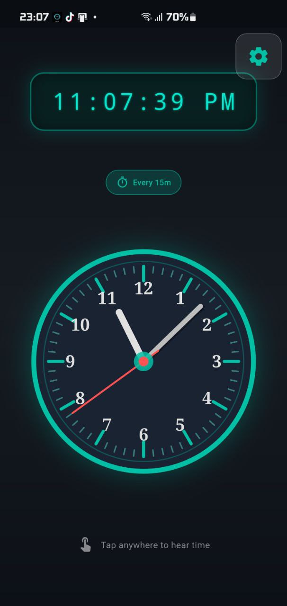
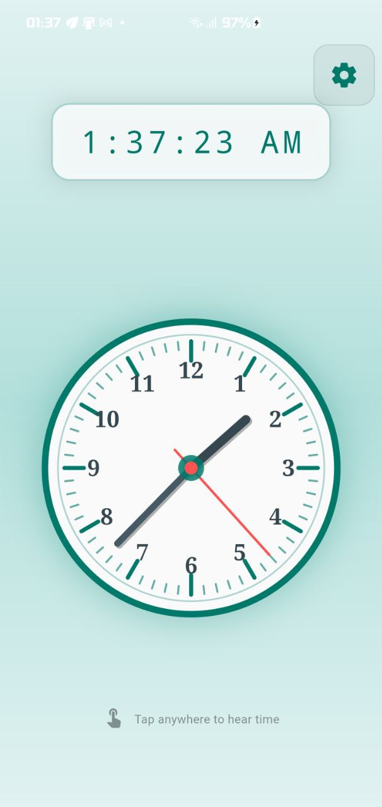
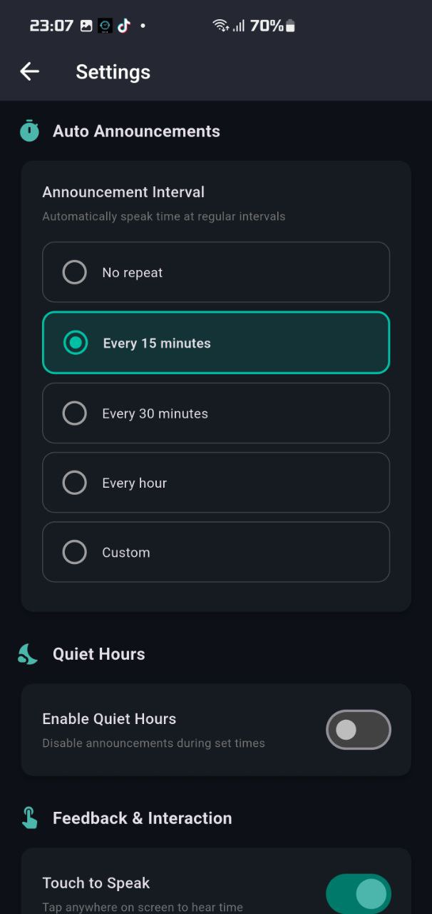
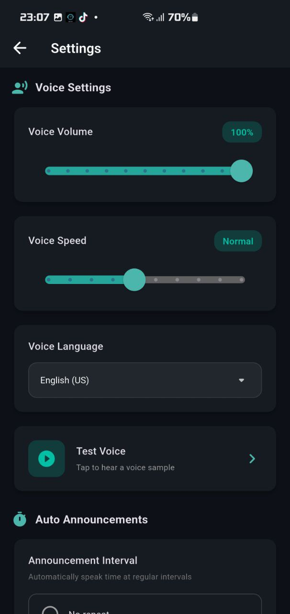
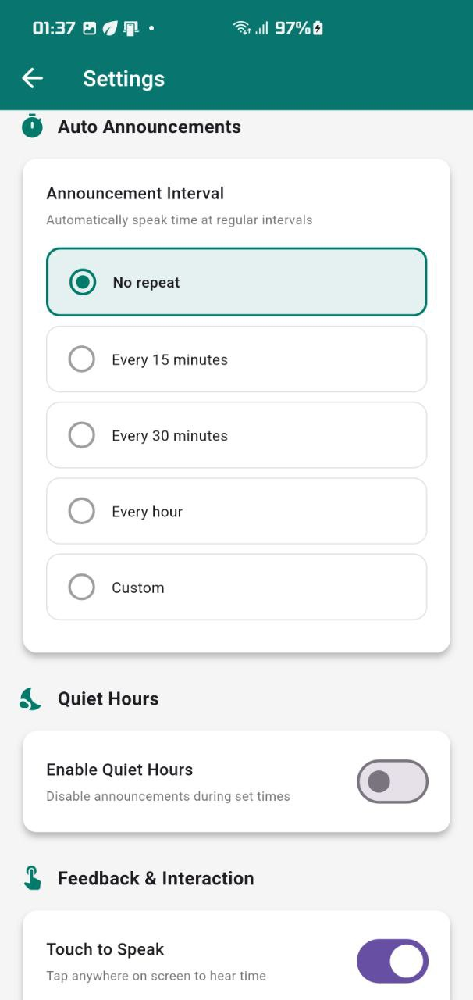
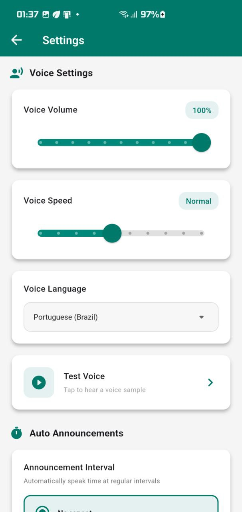
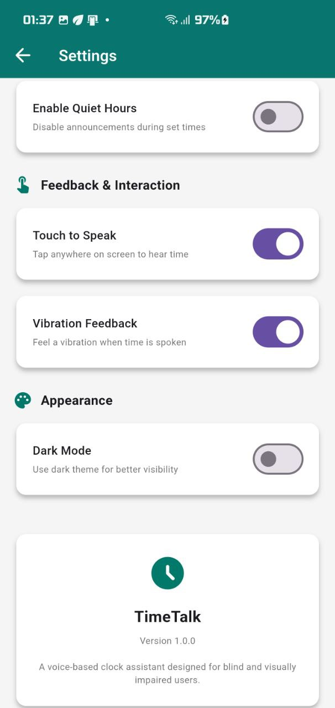

# 🕐 Talk Time

<p align="center">
  
</p>

<h3 align="center">Voice Clock for the Visually Impaired</h3>

<p align="center">
  <strong>Tap anywhere to hear the time • Automatic announcements • Works 24/7</strong>
</p>

<p align="center">
  <a href="https://github.com/abel2800/Time-Talk/releases/latest">
    
  </a>
  
  
</p>

---

## 📱 What is Talk Time?

**Talk Time** is a smartphone app designed specifically for **blind and visually impaired users** to know the time independently. No need to ask anyone - just tap your phone screen and hear the time spoken aloud!

### Why I Made This App

Many visually impaired people rely on others to tell them the time. This app gives them independence by:
- Speaking the time with a single tap
- Automatically announcing time at regular intervals
- Working silently during sleep hours
- Running 24/7 in the background

---

## ✨ Key Features

| Feature | Description |
|---------|-------------|
| 🎯 **Tap to Hear** | Touch anywhere on screen to hear current time |
| ⏱️ **Auto Announce** | Automatic time announcements every 15, 30, or 60 minutes |
| 🔄 **Repeat Count** | Say time 1-5 times so users don't miss it |
| 🌙 **Quiet Hours** | Disable announcements during sleep (e.g., 10 PM - 7 AM) |
| 🔔 **24/7 Background** | Works even when phone is locked or screen is off |
| 📳 **Vibration** | Feel a vibration when time is announced |
| 🌐 **11 Languages** | English, Spanish, French, German, Italian, Portuguese, Chinese, Japanese, Korean, Hindi, Arabic |
| 🎨 **Dark & Light Mode** | Beautiful analog clock with both themes |
| 🔊 **Voice Control** | Adjust volume and speech speed |

---

## 📸 Screenshots

### 🏠 Home Screen - The Clock

<p align="center">
  
  &nbsp;&nbsp;&nbsp;
  
</p>

<p align="center">
  <em>Left: Dark Mode | Right: Light Mode</em>
</p>

**What you see:**
- Beautiful analog wall clock with hour, minute, and second hands
- Digital time display at the top
- Status indicators showing announcement interval
- Tap anywhere on the clock to hear the time!

---

### ⚙️ Settings - Dark Mode

<p align="center">
  
  &nbsp;
  
  &nbsp;
  
</p>

| Screenshot | What It Shows |
|------------|---------------|
| **Settings 1** | Voice Settings - Volume, Speed, Language selection, Test Voice button |
| **Settings 2** | Auto Announcements - Choose interval (15/30/60 min), Repeat Count (1-5 times) |
| **Settings 3** | Quiet Hours - Enable/disable, Set start & end time, Appearance settings |

---

### ⚙️ Settings - Light Mode

<p align="center">
  
  &nbsp;
  
  &nbsp;
  
</p>

<p align="center">
  <em>Same settings in Light Mode for users who prefer brighter screens</em>
</p>

---

## 🚀 Installation

### 📥 Download APK (Recommended)

<p align="center">
  <a href="https://github.com/abel2800/Time-Talk/releases/latest">
    
  </a>
</p>

**Steps:**
1. Click the download link above
2. Download `TalkTime-v1.2.0.apk`
3. Open the file on your Android phone
4. If prompted, enable "Install from unknown sources"
5. Tap **Install**
6. Open the app and grant permissions

### 🔧 Build from Source

```bash
# Clone the repository
git clone https://github.com/abel2800/Time-Talk.git

# Navigate to project
cd Time-Talk

# Get dependencies
flutter pub get

# Build release APK
flutter build apk --release
```

---

## 📖 How to Use

### First Time Setup
1. **Open Talk Time** - The app will ask for permissions
2. **Allow Notifications** - Required for background announcements
3. **Disable Battery Optimization** - So the app works 24/7

### Daily Usage

| Action | How To |
|--------|--------|
| **Hear Time Now** | Tap anywhere on the clock screen |
| **Set Auto Announce** | Settings → Auto Announcements → Select interval |
| **Repeat Count** | Settings → Repeat Count → Choose 1-5 times |
| **Enable Quiet Hours** | Settings → Quiet Hours → Turn on → Set times |
| **Change Language** | Settings → Voice Language → Select language |
| **Adjust Voice** | Settings → Voice Volume / Speed sliders |

### Example Setup for a Blind User:
1. Set **Auto Announce** to "Every 15 minutes"
2. Set **Repeat Count** to "Twice" (says time 2 times)
3. Enable **Quiet Hours** from 10 PM to 7 AM
4. Enable **Vibration Feedback**

Now the phone will automatically say the time twice every 15 minutes, except during sleep hours!

---

## 🌍 Supported Languages

| Language | Flag | Voice Support |
|----------|------|---------------|
| English (US) | 🇺🇸 | ✅ |
| Spanish | 🇪🇸 | ✅ |
| French | 🇫🇷 | ✅ |
| German | 🇩🇪 | ✅ |
| Italian | 🇮🇹 | ✅ |
| Portuguese | 🇧🇷 | ✅ |
| Chinese | 🇨🇳 | ✅ |
| Japanese | 🇯🇵 | ✅ |
| Korean | 🇰🇷 | ✅ |
| Hindi | 🇮🇳 | ✅ |
| Arabic | 🇸🇦 | ✅ |

---

## 📋 Version History

| Version | Date | Changes |
|---------|------|---------|
| **v1.2.0** | Dec 2024 | ✅ Added Repeat Count (1-5 times) <br> ✅ Fixed screen-off announcements <br> ✅ Better background service |
| **v1.1.0** | Dec 2024 | ✅ Full app localization (11 languages) <br> ✅ UI translates with language |
| **v1.0.0** | Dec 2024 | 🎉 Initial release |

---

## 🛠️ Built With

- [Flutter](https://flutter.dev/) - Cross-platform framework
- [flutter_tts](https://pub.dev/packages/flutter_tts) - Text-to-Speech engine
- [flutter_background_service](https://pub.dev/packages/flutter_background_service) - 24/7 background operation
- [shared_preferences](https://pub.dev/packages/shared_preferences) - Settings storage

---

## 👤 Author

**Abel**
- GitHub: [@abel2800](https://github.com/abel2800)

---

## 📄 License

MIT License - Copyright (c) 2024 Abel

See [LICENSE](LICENSE) file for details.

---

<p align="center">
  
</p>

<p align="center">
  <strong>Made with ❤️ for the visually impaired community</strong>
</p>

<p align="center">
  <em>"Everyone deserves to know the time independently"</em>
</p>
