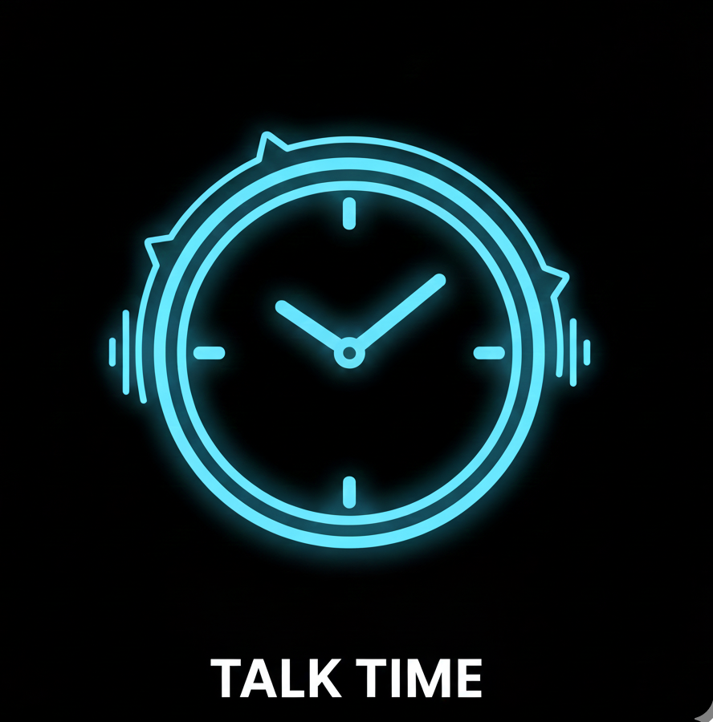

# 🕐 Talk Time - Voice Clock for the Visually Impaired

<p align="center">
  
</p>

<p align="center">
  <strong>A smartphone app that speaks the time aloud - helping blind and visually impaired users know the time without assistance.</strong>
</p>

<p align="center">
  
  
  
</p>

---

## 📱 Screenshots

<p align="center">
  
  &nbsp;&nbsp;
  
  &nbsp;&nbsp;
  
</p>

<p align="center">
  
</p>

---

## ✨ Features

### 🎯 **Designed for Accessibility**
- **Tap Anywhere** - Simply touch the screen to hear the current time
- **Large Display** - Beautiful analog clock with digital time display
- **High Contrast** - Dark mode optimized for better visibility
- **Haptic Feedback** - Feel a vibration when time is spoken

### ⏰ **Auto Announcements**
- Automatically announce the time at set intervals:
  - Every 15 minutes
  - Every 30 minutes
  - Every hour
  - Custom intervals

### 🌙 **Quiet Hours**
- Set quiet hours (e.g., 10 PM - 7 AM) to disable announcements during sleep
- Option to also block tap-to-speak during quiet hours

### 🔊 **Voice Settings**
- Adjustable voice volume
- Adjustable speech speed
- Multiple language support
- Test voice feature

### 📱 **24/7 Background Operation**
- Works even when the app is minimized or closed
- Persistent notification keeps the service active
- Battery optimization exemption for reliable operation

---

## 🚀 Installation

### From APK
1. Download the latest APK from [Releases](https://github.com/abel2800/Time-Talk/releases)
2. Enable "Install from Unknown Sources" on your Android device
3. Install the APK
4. Grant notification and battery optimization permissions when prompted

### Build from Source
```bash
# Clone the repository
git clone https://github.com/abel2800/Time-Talk.git

# Navigate to project directory
cd Time-Talk

# Get dependencies
flutter pub get

# Build APK
flutter build apk --release
```

---

## 📋 Permissions Required

| Permission | Purpose |
|------------|---------|
| Notifications | Show persistent notification for background operation |
| Battery Optimization | Keep app running 24/7 even when closed |
| Vibration | Haptic feedback when time is spoken |

---

## 🛠️ Tech Stack

- **Framework:** Flutter 3.0+
- **Language:** Dart
- **Text-to-Speech:** flutter_tts
- **Local Storage:** shared_preferences
- **Notifications:** flutter_local_notifications
- **Permissions:** permission_handler

---

## 💡 Why I Built This

I created **Talk Time** to help blind and visually impaired people easily know the time without needing assistance from others. Traditional clocks and smartphones require visual interaction, which can be challenging for those with vision impairments.

With Talk Time:
- **No need to ask anyone** - Just tap your phone screen
- **Stay independent** - Know the time anywhere, anytime
- **Simple to use** - No complex menus or tiny buttons

---

## 📄 License

This project is licensed under the MIT License - see the [LICENSE](LICENSE) file for details.

**Copyright (c) 2024 Abel**

---

## 🤝 Contributing

Contributions are welcome! Feel free to:
- Report bugs
- Suggest new features
- Submit pull requests

---

## 📞 Contact

- **GitHub:** [@abel2800](https://github.com/abel2800)

---

<p align="center">
  Made with ❤️ for the visually impaired community
</p>
